## СПм-23-5, Шевченко Ілля Олександрович
### Лабораторна робота №**2**. Редагування імітаційних моделей у середовищі NetLogo

 

### Варіант 9, модель у середовищі NetLogo:
[Shepherds](http://www.netlogoweb.org/launch#http://www.netlogoweb.org/assets/modelslib/Sample%20Models/Biology/Shepherds.nlogo)

Поділити вівець на два різних стада, відповідно і пастухів на дві різні організації. Пастухи повинні збирати тільки "своїх" вівець. Додати відключаєму можливість збирати "чужих" вівець, які після потрапляння до нового стада змінюють свою приналежність.

 

### Внесені зміни у вихідну логіку моделі, за варіантом:

## Поділити вівець на два різних стада:
Додав можливість створювання двох видів агентів:

<pre>
breed [shepherds shepherd]
</pre>
Замінив на:
<pre>
breed [shepherds1 shepherd1]
breed [shepherds2 shepherd2]
</pre>

А список глобальних змінних був модифікований таким чином:

<pre>
  globals
[
  sheepless-neighborhoods   ;; у скількох сусідніх ділянках немає овець?
  herding-efficiency        ;; вимірює, наскільки добре пасуться вівці
  blue-herding-efficiency   ;; ефективність групування синіх овець
  red-herding-efficiency    ;; ефективність групування червоних овець
  blue-sheep                ;; кількість синіх овець
  red-sheep                 ;; кількість червоних овець
]
</pre>

Після створення двох типів пастухів, ми вирішили обмежити їхню дію певними зонами, заданими координатами.

<pre>
shepherds1-own
[
  carried-sheep
  found-herd?
  homex
  homey
]
shepherds2-own
[
  carried-sheep
  found-herd?
  homex
  homey
]
</pre>

Самі координати я вирішив задати у процедурі setup:

<pre>
set-default-shape shepherds1 "person"
set-default-shape shepherds2 "person"

create-shepherds1 num-red-shepherds
[
  set homex 15
  set homey 15
  set color red
  set size 1.5
  set carried-sheep nobody
  set found-herd? false
  setxy random-xcor random-ycor 
]

create-shepherds2 num-blue-shepherds
[ 
  set homex -15
  set homey -15
  set color blue
  set size 1.5
  set carried-sheep nobody
  set found-herd? false
  setxy random-xcor random-ycor 
]
</pre>
Тепер при старті створюються два типа вівчарів - червоні та красні. Для червоних координати загону становлять (15,15), а для синіх - (-15, -15).

 

Були додані наступні елементи **setup**:

Важіль для кількості "красних" вівчарів на початку:

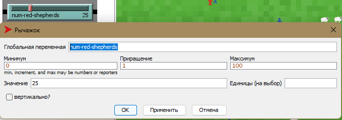

Важіль для кількості "синіх" вівчарів на початку:

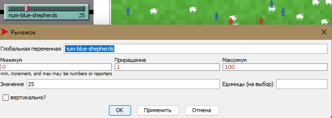

Були додані наступні елементи статистики:

Показник, що відображає поточну кількість "червоних" вівчарів:

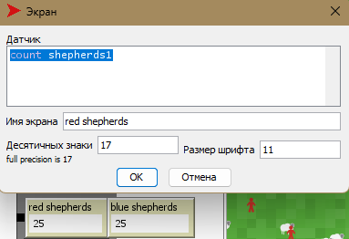

Показник, що відображає поточну кількість "синіх" вівчарів:

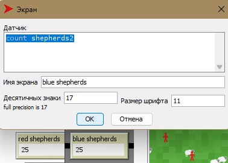

Показник, що відображає поточну кількість "червоних" вівчарів:

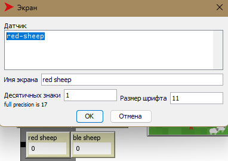

Показник, що відображає поточну кількість "синіх" овець:

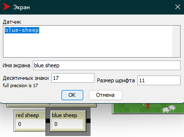

 

Через те, що тепер у вівчарів є загони - їм була створена нова логіка для "переносу" овець:

<pre>
ask shepherds1
  [ 
    ifelse carried-sheep = nobody
    [ 
      ifelse sqrt(((homex - xcor) ^ 2) + ((homey - ycor) ^ 2)) > 5
      [search-for-sheep]
      [
        wiggle
        fd 1
      ]
    ]
    [ 
      ifelse found-herd?
      [ find-empty-spot ]
      [ find-new-herd ] 
    ]
    if carried-sheep != nobody
    [ ask carried-sheep [ move-to myself ] ] 
  ]
</pre>
У кінці процедри підраховуються кількості овець
<pre>
set blue-sheep count sheep with [color = blue]
set red-sheep count sheep with [color = red]
</pre>

Тепер пастух шукає овець лише за певних умов: якщо він далеко від загону і не несе іншу вівцю. Після того, як пастух знаходить вівцю, він несе її до загону і залишає там. Оскільки є два типи загонів і пастухів, ми вирішили позначати овець кольоровими мітками, залежно від того, хто їх знайшов. Крім того, ми додали можливість для пастуха відмовитися від вівці з іншим кольором мітки.

<pre>
to search-for-sheep
  wiggle
  fd 1
  let personal-color color
  set carried-sheep one-of sheep-here with [not hidden? and (color = personal-color or color = white or (random 99) + 1 <= steal-chanse)]
  if (carried-sheep != nobody)
  [
    ask carried-sheep
    [ 
      set color personal-color
      hide-turtle
    ]
    fd 1 
  ]
end
</pre>

 

Були додані наступні елементи, що впливають під час роботи симуляції:

Важіль для налаштування ймовірності "кражі" вівці іншої команди:

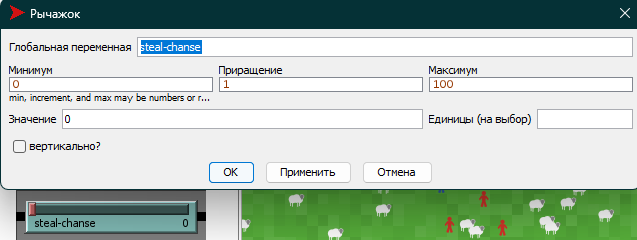

 

Скріншот роботи симуляції пістя внесених змін:

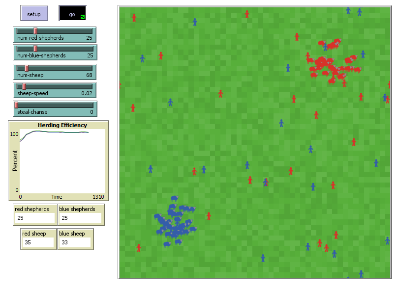

 

## Внесені зміни у вихідну логіку моделі, на власний розсуд:

Дивлячись на схожу модель **Fruit Wars** було вирішено додати пастухам можливість вбити пастуха з протилежної команди, мотивуючи це тим, що таким чином його команда зможе зібрати більше овець.

До процедури **to go** були додані наступні рядки:

<pre>
if count shepherds2-on neighbors >= gang-size and ((random 99) + 1 <= kill-chanse)
[
  print "red shepherd died"
  die
]
</pre>
Для додання шансу на вбивство у червоних.

<pre>
if count shepherds2-on neighbors >= gang-size and ((random 99) + 1 <= kill-chanse)
[
  print "red shepherd died"
  die
]
</pre>
Для додання шансу на вбивство у синіх.

 

Додано два відповідні важілі:

Важіль для налаштування шансу на вбивство:

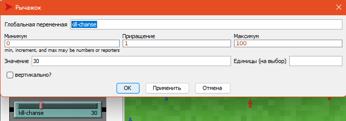

Важіль для налаштування мініммальної кількості "вбивць":

 

"Ми змінили правила вбивства пастухів, щоб уникнути копіювання інших ідей. Тепер, коли пастух опиняється оточений великою кількістю ворогів, є шанс, що його вб'ють. Якщо це станеться, вівця, яку він ніс, також гине.
## Обчислювальний експеримент:

Зберігаючи одні й ті самі параметри досліджується поле з вівчарами та вівцями:
Експеримент проводиться з такими параметрами:
- **num-red-shepherds** 25
- **num-blue-shepherds** 25
- **num-sheep** 68
- **sheep-speed** 0.02
- **steal-chanse** 30
- **kill-chance** 30
- **gang-size** 8

Були підібрані усереднені результати симуляцій:

Скріншот1:

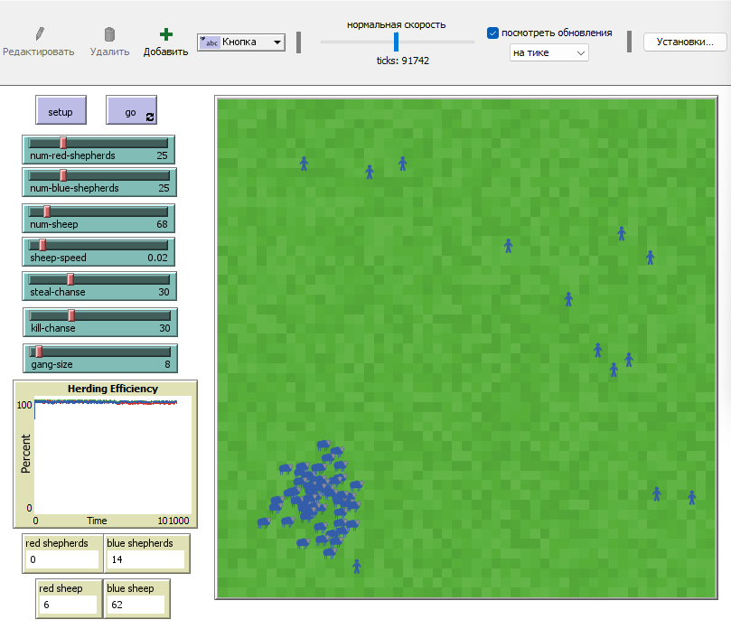

Як можна побачити на скриншоті 1 - по проходженню 91742 тактів на полі залишилося 14 синіх вівчарів та 62 синіх вівці. 6 овець було випадково вбито у процесі захвату.

Скріншот2

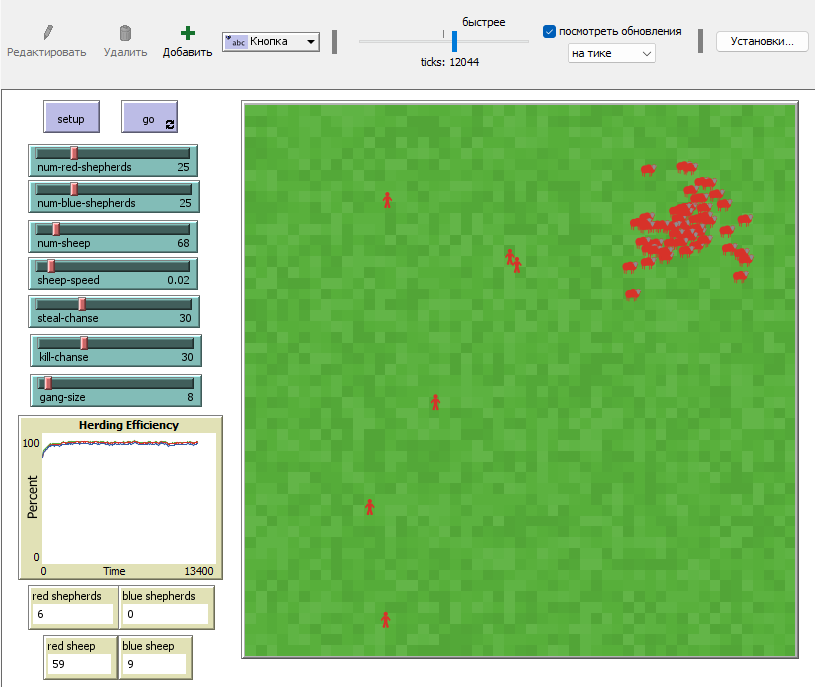

Як можна побачити на скриншоті 2 - по проходженню 12044 тактів на полі залишилося 6 червоних вівчарів та 59 червоних вівці. 9 овець було випадково вбито у процесі захвату.

 

### Висновок:
Мета роботи полягала у модифікації існуючої моделі "Shepherds" в середовищі NetLogo з метою дослідження динаміки взаємодії двох груп пастухів та овець, розділених за кольоровою ознакою. Внесені зміни мали на меті створити більш складну та реалістичну модель, що враховує конкуренцію між групами за ресурси.
